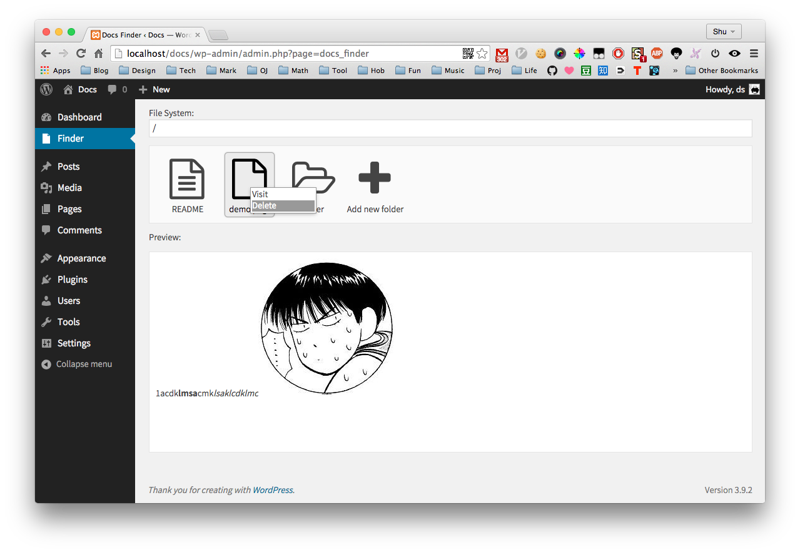
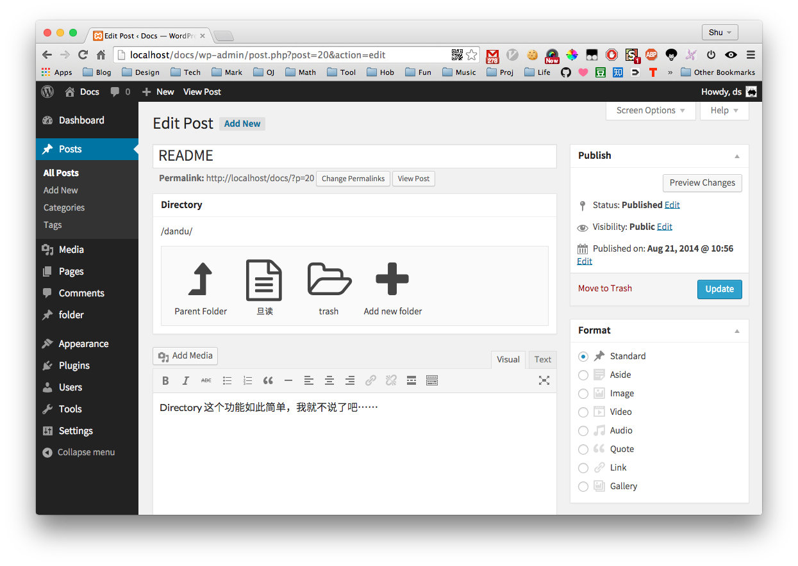

# docs

`docs` is a wordpress plugin, it provides **CMS / file tree system** to wordpress. So you can make wordpress a wiki system or something else.

### Preview

### Usage

Just copy the `docs` folder to `/wp-content/plugins/` and enable the plugin.

### Info

`Font awesome` and `jQuery` are used.

### Author / License

This plugin is developed for `Fudan STU Wiki System`.

Author: [Shu Ding](https://github.com/quietshu)

License: The MIT License
